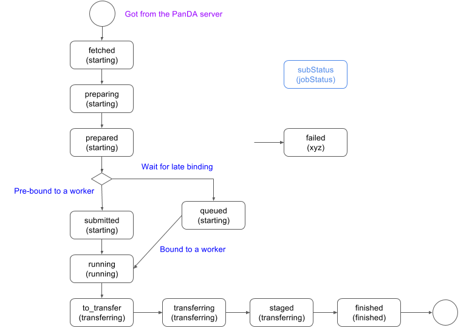
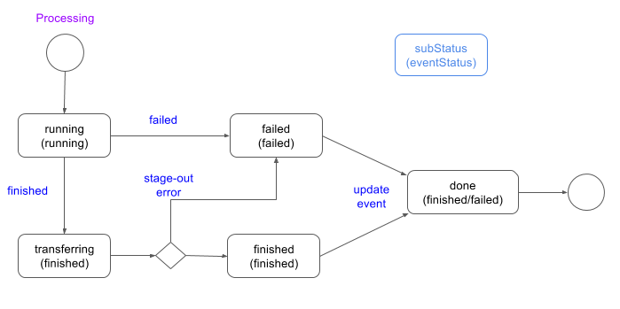

# Harvester

### Introduction

Harvester is a resource-facing service between the PanDA server and collection of pilots.
It is a lightweight stateless service running on a VObox or an edge node of HPC centers
to provide a uniform view for various resources.

----------

### Installation
Harvester can be installed with or without root privilege.


#### With root privilege

#### Without root privilege
```sh
# # setup virtualenv (N.B. if your system supports conda instead of virtualenv see "How to use conda" in the Misc section) 
$ virtualenv harvester
$ cd harvester
$ . bin/activate

$ # install additional python packages if missing
$ pip install pip --upgrade
$ pip install python-daemon
$ pip install requests

$ # install panda components
$ pip install git+git://github.com/PanDAWMS/panda-common.git@setuptools
$ pip install git+git://github.com/PanDAWMS/panda-harvester.git

$ # copy sample setup and config files
$ mv etc/sysconfig/panda_harvester.rpmnew.template  etc/sysconfig/panda_harvester
$ mv etc/panda/panda_common.cfg.rpmnew.template etc/panda/panda_common.cfg
$ mv etc/panda/panda_harvester.cfg.rpmnew.template etc/panda/panda_harvester.cfg

```


#### Setup and system configuration files
Several parameters need to be adjusted in the setup file (etc/sysconfig/panda_harvester)
and two config files (etc/panda/panda_common.cfg and etc/panda/panda_harvester.cfg).

The following parameters need to be modified in etc/sysconfig/panda_harvester.

Name | Description  
--- | --- 
PANDA_HOME | Config files must be under $PANDA_HOME/etc
PYTHONPATH | Must contain the pandacommon package and site-packages where the pandaharvester package is available

- Example
```
export PANDA_HOME=$VIRTUAL_ENV
export PYTHONPATH=$VIRTUAL_ENV/lib/python2.7/site-packages/pandacommon:$VIRTUAL_ENV/lib/python2.7/site-packages
```

The **logdir** needs to be set in etc/panda/panda_common.cfg. It is recommended to use a non-NFS directory to avoid buffering.

Name | Description 
--- | --- 
logdir | A directory for log files

- Example
```
logdir = /var/log/panda
```

The following list shows parameters need to be adjusted in etc/panda/panda_harvester.cfg.

Name | Description  
--- | --- 
master.uname | User ID of the daemon process
master.gname | Group ID of the daemon process
db.database_filename | Filename of the local database
db.verbose | Set True to dump all SQL queries in the log file
pandacon.ca_cert | CERN CA certificate file
pandacon.cert_file | A grid proxy file to access the panda server
pandacon.key_file | The same as pandacon.cert_file
qconf.configFile | The queue configuration file. See the next section for details
qconf.queueList | The list of PandaQueues for which the harvester instance works
credmanager.moduleName | The module name of the credential manager
credmanager.className | The class name of the credential manager
credmanager.certFile | A grid proxy without VOMS extension. NoVomsCredManager generates VOMS proxy using the file


#### Queue configuration file

Plug-ins for each PandaQueue is configured in the queue configuration file.
The filename is defined in **qconf.configFile** and has to be put in the $PANDA_HOME/etc/panda
directory. This file might be integrated in the information system json in the future, but for
now it has to be manually created. Here is an
[example](https://github.com/PanDAWMS/panda-harvester/blob/master/examples/panda_queueconfig.json)
of the queue configuration file. The contents is a json dump of 

```python
{
"PandaQueueName1": {
		   "QueueAttributeName1": ValueQ_1,
		   "QueueAttributeName2": ValueQ_2,
		   ...
		   "QueueAttributeNameN": ValueQ_N,
		   "Agent1": {
		   	     "AgentAttribute1": ValueA_1,
			     "AgentAttribute2": ValueA_2,
			     ...
			     "AgentAttributeM": ValueA_M
			     },
		   "Agent2": {
		   	     ...
			     },
		   ...
		   "AgentX": {
		   	     ...
		   	     },
		   },
"PandaQueueName2": {
		   ...
		   },
...
"PandaQueueNameY": {
		   ...
		   },

}
```

Here is the list of queue attributes.

Name | Description  
--- | --- 
prodSourceLabel | Source label of the queue. _managed_ for production
nQueueLimitJob | The max number of jobs pre-fetched and queued
nQueueLimitWorker | The max number of workers queued in the batch system
maxWorkers | The max number of workers. maxWorkers-nQueueLimitWorker is the number of running workers
mapType | Mapping between jobs and workers. OneToOne = (1 job x 1 worker). OneToMany = 1xN. ManyToOne = Nx1 
useJobLateBinding | true if the queue uses job-level late-binding

Agent is **preparator**, **submitter**, **workMaker**, **messenger**,
**stager**, **monitor**, and **sweeper**. Two agent parameters `name` and `module`
are mandatory to define the class name module names of the agent.
Roughly speaking,
```python
from agentModle import agentName
agent = agentName()
```
is internally invoked. Other agent attributes are set to the agent instance as instance variables.

----------

### Tests

First setup environment variables.
```sh
$ source etc/sysconfig/panda_harvester
```
All log files are available in the logdir which is defined in etc/panda/panda_common.cfg.
The filename is panda-*ClassName*.log where *ClassName* is a plug-in or agent class name.

#### Unit tests
* Testing the local database and connection to PanDA
```sh
$ python lib/python*/site-packages/pandaharvester/harvestertest/basicTest.py
```

* Testing submission and monitoring with the batch system
```sh
$ python lib/python*/site-packages/pandaharvester/harvestertest/submitterTest.py [PandaQueueName]
```

* Testing stage-in
```
python -i lib/python*/site-packages/pandaharvester/harvestertest/stageInTest.py [PandaQueueName]
```

* Testing stage-out
```sh
python -i lib/python*/site-packages/pandaharvester/harvestertest/stageOutTest.py [PandaQueueName]
```

#### Functional tests
Harvester runs multiple threads in parallel so that debugging is rather complicated. However, functions can be
gradually executed by using
```sh
$ python lib/python*/site-packages/pandaharvester/harvesterbody/master.py --pid $PWD/tmp.pid --single
```

----------

### Run
Start daemon
```sh
$ python lib/python*/site-packages/pandaharvester/harvesterbody/master.py --pid $PWD/tmp.pid
```
Stop deamon

```sh
$ kill -USR2 `cat $PWD/tmp.pid`
```

----------

### Misc

#### How to setup virtualenv if unavailable by default
* For NERSC
```sh
$ module load python
$ module load virtualenv
```
* For others
```sh
$ pip install virtualenv --user
```
or more details in https://virtualenv.pypa.io/en/stable/installation/


#### How to install python-daemon on Edison@NERSC
```sh
$ module load python
$ cd harvester
$ . bin/activate
$ pip install --index-url=http://pypi.python.org/simple/ --trusted-host pypi.python.org  python-daemon
```


#### How to install rucio-client on Edison@NERSC (Required only if RucioStager is used)
```sh
$ cd harvester
$ . bin/activate
$ pip install --index-url=http://pypi.python.org/simple/ --trusted-host pypi.python.org rucio-clients
$ cat etc/rucio.cfg.atlas.client.template | grep -v ca_cert > etc/rucio.cfg
$ echo "ca_cert = /etc/pki/tls/certs/CERN-bundle.pem" >> etc/rucio.cfg
$ echo "auth_type = x509_proxy" >> etc/rucio.cfg
$
$ # For tests
$ export X509_USER_PROXY=...
$ export RUCIO_ACCOUNT=...
$ rucio ping
```


#### How to install local panda-harvester package
```sh
$ cd panda-harvester
$ python setup.py sdist; pip install dist/pandaharvester-*.tar.gz --upgrade
```


#### How to use conda
If your system supports conda instead of virtualenv, setup conda before using pip.
* For Cori@NERSC
```sh
$ module load python
$ conda create --name harvester python
$ mkdir harvester
$ cd harvester
$ source activate harvester
```
 
----------

### State diagrams

* Job state diagram  
  


* Worker state diagram  
  


* File state diagram  
  


* Event state diagram  
  


----------

### Plug-in descriptions